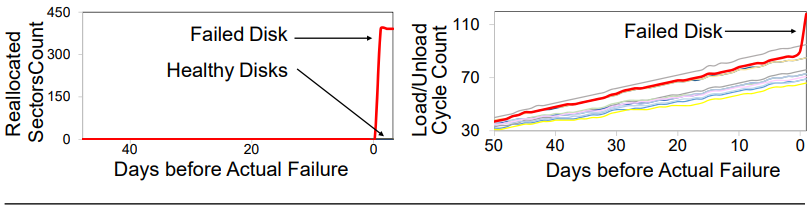

# disk_failure_prediction
This repository contains the code for the paper **Making Disk Failure Predictions SMARTer!** (The **18th USENIX Conference on File and Storage Technologies ([FAST '20](https://www.usenix.org/conference/fast20))** ) by [Sidi Lu](http://codegreen.cs.wayne.edu/sidi/), [Bing Luo](http://codegreen.cs.wayne.edu/bing/), [Tirthak Patel](http://www1.ece.neu.edu/~tirthak/), [Yongtao Yao](http://codegreen.cs.wayne.edu/yongtao/), [Devesh Tiwari](https://coe.northeastern.edu/people/tiwari-devesh/), and [Weisong Shi](https://engineering.wayne.edu/profile/ao3342). [[pdf](https://www.usenix.org/system/files/fast20-lu.pdf)] [[project page](http://codegreen.cs.wayne.edu/wizard/)] 


This study covers the disk and server data measured and collected at a large data center. Over, the dataset spans over 64 data center sites, 10,000 server racks and 380,000  hard  disks  for  roughly  70  days.  This corresponds to roughly 2.6 million device hours. We note that during this period, the data center housed more than two million hard disks, but not all of them are included in our study because we only focus on those disks that have logged data in all three aspects: SMART, performance, and location. 



​                              **Figure 1**: SMART attributes of healthy vs. failed disks prior to disk failures.


​                              **Figure 2**: Performance metrics of healthy vs. failed disks prior to disk failures.

We conducted a field study of HDDs based on a large-scale dataset collected from a leading ecommerce production data center, including SMART attributes, performance metrics, and location markers. We discover that performance metrics are good indicators of disk failures. We also found that location markers can improve the accuracy of disk failure prediction. Lastly, we trained machine learning models including neural network models to predict disk failures with 0.95 F-measure and 0.95 MCC for 10 days prediction horizon.


**Figure 3**: Model prediction quality with different groups of SMART (S), performance (P), and location (L) features.


**Figure 4**: Model false positive rate (FPR = FP/(FP + TN)) and false negative rate (FNR = FN/(TP + FN)).

## Training Model

- [CNN-LSTM](https://github.com/SidiLu001/disk_failure_prediction/tree/master/src#cnn-lstm)
- [LSTM](https://github.com/SidiLu001/disk_failure_prediction/tree/master/src#lstm)
- [RF](https://github.com/SidiLu001/disk_failure_prediction/tree/master/src#rf)
- [GBDT](https://github.com/SidiLu001/disk_failure_prediction/tree/master/src#gbdt)
- [BAYES](https://github.com/SidiLu001/disk_failure_prediction/tree/master/src#bayes)

## Citation

```
@inproceedings {246172,
author = {Sidi Lu and Bing Luo and Tirthak Patel and Yongtao Yao and Devesh Tiwari and Weisong Shi},
title = {Making Disk Failure Predictions SMARTer!},
booktitle = {18th {USENIX} Conference on File and Storage Technologies ({FAST} 20)},
year = {2020},
isbn = {978-1-939133-12-0},
address = {Santa Clara, CA},
pages = {151--167},
url = {https://www.usenix.org/conference/fast20/presentation/lu},
publisher = {{USENIX} Association},
month = feb,
}
```


## Contact


[Sidi Lu, Wayne State University](mailto:lu.sidi@wayne.edu "Sidi Lu, Wayne State University") 

